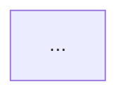

# Artifact templates — codebase-onboarding

Exact skeletons for every file the skill writes. Headings are required;
per-section guidance is in the blockquotes; miniature examples show the
expected grain. Replace `<target>` with the target repo's name.

**Evidence-citation format, used everywhere:** append `(see path/to/file)`
to the sentence the path supports — repository-relative paths only, never
absolute home or machine paths. Claims without a path must be labeled
`(inferred)` or listed as an unknown. Unknowns are written as:
`Unknown — verify with the team: <question>`.

**Command tier tags**, printed after every command:
`[documented]` (claimed in docs only), `[corroborated: <path>]` (appears in
CI or scripts), `[executed]` (actually run this session, with user approval).

---

## `README.md` — orientation

```markdown
# Onboarding: <target>

One-paragraph answer to "what does this system do, for whom" (see <path>).

## How to use these docs
| Doc | Read when |
|---|---|
| [getting-started.md](getting-started.md) | Before writing any code |
| [architecture.md](architecture.md) | Before your first non-trivial change |
| [conventions.md](conventions.md) | Before your first PR |
| [glossary.md](glossary.md) | Whenever a domain term is unfamiliar |
| [first-change.md](first-change.md) | For your first change, end to end |
| [gotchas.md](gotchas.md) | When something looks wrong or surprising |

## Your first 30 minutes
Ordered walk through the top-5 files (from exploration), one paragraph per
file: what it is, why it is read at this point, what to notice.

## Where to get help
Owners/teams/channels if discoverable from CODEOWNERS or docs; otherwise an
explicit unknown.
```

> The tour is the heart of this file: five real files in reading order, each
> with a "what to notice" that a newcomer could not guess. Example grain:
> "3. `src/router.ts` — every request enters here; notice the middleware
> chain is built once at boot, not per request (see src/router.ts)."

## `architecture.md` — structure and flow

```markdown
# Architecture

## System context
What the system talks to: callers, stores, external services (see <paths>).

## Component map
| Component | Path | Responsibility |
|---|---|---|

## Structure diagram


## Dominant flow: <name>
Step-by-step lifecycle of the main request/data flow, each step citing the
file that implements it. A second flow section only if genuinely dominant.

## Key abstractions
Per abstraction: what it models, where defined, one usage example path.

## External dependencies
| Dependency | Used for | Where wired |
|---|---|---|
```

> Diagrams show the components the map lists — same names, no more. If the
> flow cannot be traced with evidence, the section says which hop is
> `(inferred)` rather than drawing a confident lie.

## `getting-started.md` — commands that work

```markdown
# Getting started

## Prerequisites
| Requirement | Evidence |
|---|---|

## Environment variables
| Name | Purpose | Where read |
|---|---|---|
(Names only — never values or secrets.)

## Setup
Each step: the command, its tier tag, and its evidence path.

## Build / Test / Run
Same format. Example:
- `make test` — runs unit tests [corroborated: .github/workflows/ci.yml]

## Troubleshooting your first hour
Likely first failures and their fixes, each grounded in something observed
(a version pin, a required service, a known-flaky suite) or tagged inferred.
```

> Honesty over polish: a guide that says "documented but not executed" is
> useful; one that silently guesses is a trap.

## `conventions.md` — how code review will judge you

```markdown
# Conventions

## Code style
| Rule | Evidence |
|---|---|

## Tests
Layout, naming, and patterns; name one exemplar test file to copy from.

## Error handling and logging
The house idiom with >= 1 example path each.

## Commits and PRs
Observed commit-message style, branch naming, PR expectations (from
contribution docs or the log itself).

## How review will judge you
Bullets: the 3-5 things reviewers here demonstrably care about.
```

## `glossary.md` — the domain in one page

```markdown
# Glossary

## Domain terms
| Term | Meaning | Defined at |
|---|---|---|

## Configuration surface
| Name | Kind (env/flag/file) | Purpose | Where read |
|---|---|---|---|

## External integrations
| Integration | Purpose | Credential expected (name only) |
|---|---|---|
```

> Terms come from the code's own nouns (types, tables, module names), not
> from generic industry vocabulary. Example grain: "`Ledger` — append-only
> record of billing events; defined at billing/ledger.py."

## `first-change.md` — a realistic walkthrough

```markdown
# Your first change

## The change
One realistic, small change in a real module (pick from the exploration's
low-risk, well-tested areas — never a hypothetical).

## Where it goes
The files to touch and why these (see <paths>).

## Tests that cover it
The existing tests guarding this area; which to extend; the exemplar to copy.

## How to verify
The exact commands, tier-tagged, in order.

## What review will check
The conventions from conventions.md that bite on precisely this change.
```

## `gotchas.md` — surprises, honestly labeled

```markdown
# Gotchas and FAQ

## Change hotspots
| Path | Churn | Why it matters |
|---|---|---|

## Docs vs disk
Each surviving conflict from synthesis: what the docs say, what disk shows,
which wins and why.

## Footguns
Each tagged `observed` (with path) or `inferred`.

## Looks wrong, is intentional
Same tagging.

## Open questions
Every `Unknown — verify with the team: ...` collected in one place.
```

---

## `CLAUDE.md` draft skeleton (Step 4)

Lean by design — detail lives in the onboarding docs, per the layering
philosophy of `bootstrap-claude-context`'s `references/layering.md`.

```markdown
# <target>

<2-3 lines: what the project is and its primary language/framework.>

- Build: `<command>`  ·  Test: `<command>`  ·  Run: `<command>`
  (corroborated commands only; cite nothing here that Step 3 could not tag
  at least [corroborated])
- <3-5 highest-value conventions, one line each>
- New to this codebase? Start at `docs/onboarding/README.md`.
```

When a CLAUDE.md already exists, the proposal is an exact diff adding only:
missing corroborated commands, missing high-value conventions, and the
onboarding pointer. Never reword existing lines; never delete.

---

## `onboarding.html` (Step 5)

Not templated here — copy `assets/onboarding-template.html` and fill its
placeholders. Section order matches the reading order in `README.md`'s doc
index. Keep each doc as one `<section id="...">` whose heading matches the
doc title, so the nav is a 1:1 index of the package.
