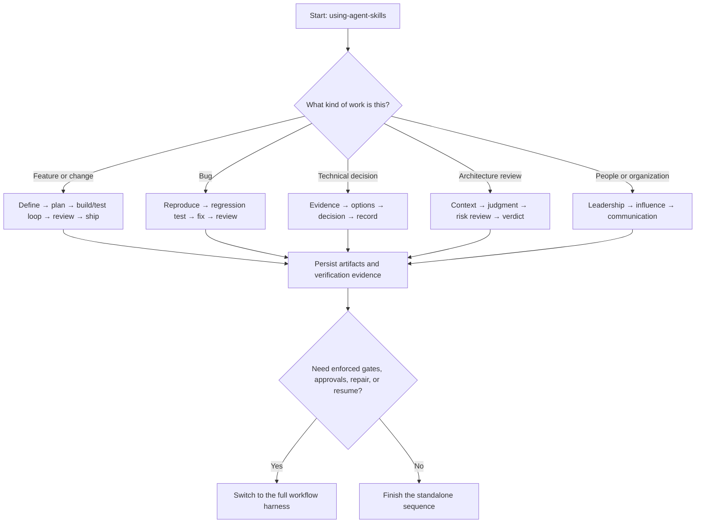

# Using Practice Skills Outside the Workflow Harness

The practice skills in `harness/skillpacks/` can be used directly in Claude
Code without starting a harness workflow. Standalone use is useful when you
want one discipline or a lightweight sequence and are prepared to manage the
handoffs and review points yourself.

This guide covers all five packs:

- `harness/skillpacks/addyosmani/`: 24 engineering lifecycle skills, including
  the `using-agent-skills` meta-skill.
- `harness/skillpacks/tech-director/`: 7 skills for technical judgment,
  organizational influence, risk, communication, and people leadership.
- `harness/skillpacks/distinguished-engineer/`: 8 skills for deep-IC technical
  mastery — technical strategy, problem framing, back-of-envelope estimation,
  failure-domain thinking, deep system debugging, large-scale migration
  design, complexity budgeting, and force multiplication. Mostly ad hoc by
  design: attach them where the work type (a migration, a hard bug, a
  strategy) calls for them.
- `harness/skillpacks/geoffreylitt/`: 3 skills for understanding AI-written
  code — literate code explainers, comprehension quizzes, and ephemeral
  interactive micro-worlds. Ad hoc by design: apply them after (or alongside)
  any implementation work whose output a human must genuinely understand,
  e.g. `code-explainers` + `understanding-quizzes` once a change is built,
  and `micro-worlds` when reading alone gives no feel for runtime behavior.
- `harness/skillpacks/review-debt/`: 1 skill for evidence-backed review of
  reviewability and hidden review debt.

## What standalone mode does not provide

A skill is a set of instructions, not a replacement for the harness. Loading
one or more skills does **not** activate the orchestration protocol in
`HARNESS.md`.

| Harness guarantee | What happens in standalone mode |
|---|---|
| Automatic work-type and risk routing | You or Claude select the skills. |
| Risk overlays and approval checkpoints | You identify risk and request approvals. |
| Fresh producer contexts | Work normally stays in the current conversation unless you deliberately start a fresh context. |
| Independent blocking validators | Review is optional and advisory unless you enforce a stop yourself. |
| Bounded repair loops and escalation | You decide whether to revise, retry, escalate, or stop. |
| Externalized, resumable run state | You maintain explicit artifact paths and handoff notes. |

The harness-specific `agentic-delivery-router` and `workflow-composer` skills
are therefore **not** part of the standalone sequences below. Use
`using-agent-skills` as the lightweight standalone router. Use the full harness
when you need its stronger execution and validation guarantees.

## Choose a usage mode

Claude Code discovers skills from project `.claude/skills/`, personal
`~/.claude/skills/`, and installed plugins. See the official
[Claude Code skills documentation](https://code.claude.com/docs/en/slash-commands)
for the current discovery and invocation behavior.

### Mode A: one-off path loading

Use this mode while Claude Code has access to this repository and you do not
want to install anything. Start with this prompt:

```text
Read harness/skillpacks/addyosmani/using-agent-skills/SKILL.md fully.

For the task below, select the smallest applicable standalone skill sequence.
Before each step, read that skill's SKILL.md fully, state the input artifacts,
expected output artifact, and verification evidence, then follow the skill.

Do not invoke .claude/skills/agentic-delivery-router or
.claude/skills/workflow-composer. Do not initialize runs/ or claim that a
manual review is a harness validation gate.

Task: <describe the task>
Target repository or inputs: <paths>
Required output: <path or deliverable>
Constraints: <constraints>
```

For a selected skill, ask Claude to read its exact path before applying it:

```text
Read harness/skillpacks/<pack>/<skill>/SKILL.md fully and apply it to the
current task. Use <input paths>. Write or update <output path>. Verify the
result with <checks>. Stop and report if the inputs are insufficient.
```

If the target repository is elsewhere, launch Claude Code where both locations
are readable, add the skills checkout with `--add-dir`, or use personal
installation.

### Mode B: personal installation

Personal installation makes the skills available across projects and enables
direct `/skill-name` invocation. From the root of this repository, run:

```bash
repo_root="$(git rev-parse --show-toplevel)"
mkdir -p "$HOME/.claude/skills"

for pack in addyosmani tech-director distinguished-engineer geoffreylitt review-debt; do
  for source in "$repo_root/harness/skillpacks/$pack"/*; do
    [ -f "$source/SKILL.md" ] || continue
    name="$(basename "$source")"
    target="$HOME/.claude/skills/$name"

    if [ -e "$target" ]; then
      printf 'SKIP %s (already exists)\n' "$name"
      continue
    fi

    cp -R "$source" "$target"
    printf 'INSTALLED %s\n' "$name"
  done
done
```

The loop only copies directories containing `SKILL.md` and skips every target
that already exists. It never overwrites a personal skill. Review skipped
names before deciding whether to keep the existing skill, rename one copy, or
use one-off path loading. Personal skills take precedence over project skills
with the same name.

In Claude Code, run `/skills` and confirm the expected names appear. If the
top-level `~/.claude/skills` directory was created after the session started,
restart Claude Code once so it can watch the directory. Then invoke a skill
directly, for example:

```text
/using-agent-skills Plan and implement a rate limiter for the API client.
```

or:

```text
/options-and-tradeoffs Compare PostgreSQL and DynamoDB for the audit log.
```

Copied skills do not update automatically when this repository changes. Repeat
the installation deliberately after reviewing upstream changes; do not remove
the collision guard merely to force an update.

## Use a manual invocation contract

Outside the harness, make every handoff explicit and file-backed. Fill in this
contract before invoking each skill:

```text
STANDALONE SKILL INVOCATION
- Task goal: <one outcome>
- Skill: <skill name and SKILL.md path, or /skill-name>
- Input paths: <requirements, source, prior artifact, or repository paths>
- Constraints: <scope, compatibility, deadline, risk, and prohibited changes>
- Expected output path: <where the durable result must be written>
- Acceptance criteria: <observable conditions the output must satisfy>
- Verification evidence: <tests, commands, review checklist, or cited sources>
- Next skill: <next skill name, or STOP>
```

After the skill finishes:

1. Confirm the expected artifact exists at the declared path.
2. Run or inspect the declared verification evidence.
3. Record unresolved assumptions and risks in the artifact or handoff note.
4. Pass file paths—not a memory-only summary—to the next skill.
5. Stop when acceptance criteria fail; revise, ask for input, or escalate before
   continuing.

## Select the sequence

Use the smallest sequence that covers the task. The markers in the tables mean:

| Marker | Meaning |
|---|---|
| **R** | Required for this path. |
| **C** | Conditional; use only when its trigger applies. |
| **↻** | Repeated as part of a working loop. |
| **∥** | Parallel or cross-cutting discipline applied while another step runs. |



### Feature or change delivery

| Order | Skill | Marker | Use and handoff |
|---:|---|:---:|---|
| 1 | `using-agent-skills` | **R** | Classify the task and select the minimum sequence. |
| 2 | `interview-me` | **C** | Use when the desired outcome or constraints are unclear. Produce clarified requirements. |
| 3 | `idea-refine` | **C** | Use when alternatives need to be generated or narrowed. Produce a selected direction and tradeoffs. |
| 4 | `spec-driven-development` | **R** | Produce requirements, acceptance criteria, scope, and non-goals before code. |
| 5 | `planning-and-task-breakdown` | **R** | Turn the approved spec into small, ordered, verifiable tasks. |
| 6 | `context-engineering` | **R** | Load only the code, conventions, and prior artifacts required for the next slice. |
| 7 | `source-driven-development` | **C** | Verify version-sensitive behavior against primary documentation when external APIs or tools are involved. |
| 8 | `incremental-implementation` + `test-driven-development` | **R ↻** | For each thin slice: failing test → minimal implementation → passing test → evidence, then repeat. |
| 9 | `frontend-ui-engineering` | **C ∥** | Apply during UI slices; include accessibility and runtime UI verification. |
| 10 | `api-and-interface-design` | **C ∥** | Apply while changing public or internal contracts; record compatibility decisions. |
| 11 | `observability-and-instrumentation` | **C ∥** | Apply while building operationally important behavior, not as an afterthought. |
| 12 | `security-and-hardening` | **C ∥** | Apply to auth, permissions, secrets, sensitive data, and untrusted input. |
| 13 | `performance-optimization` | **C ∥** | Use only with a measured performance or cost target and before/after evidence. |
| 14 | `doubt-driven-development` | **C ∥** | Cross-examine high-stakes, unfamiliar, or hard-to-reverse decisions during implementation. |
| 15 | `browser-testing-with-devtools` | **C ↻** | Use for browser behavior; verify each relevant slice in the real runtime. |
| 16 | `code-review-and-quality` | **R** | Review the complete diff against requirements and verification evidence. |
| 17 | `code-simplification` | **C** | Reduce unnecessary complexity without changing verified behavior. |
| 18 | `documentation-and-adrs` | **C** | Document user-facing behavior or consequential decisions. |
| 19 | `deprecation-and-migration` | **C** | Plan compatibility, rollout, and removal when replacing existing behavior. |
| 20 | `git-workflow-and-versioning` | **R** | Keep the branch and commits scoped, reviewable, and intentional. |
| 21 | `ci-cd-and-automation` | **C** | Add or update automated gates when the delivery path or checks change. |
| 22 | `shipping-and-launch` | **C** | Use when releasing or deploying; include monitoring and rollback evidence. |

The implementation and TDD skills form one repeated micro-loop. Do not write
all production code and defer tests to a later numbered step. Cross-cutting
skills marked **∥** constrain the slices while they are being built.

### Bug fix

| Order | Skill | Marker | Use and handoff |
|---:|---|:---:|---|
| 1 | `using-agent-skills` | **R** | Confirm this is corrective work rather than an unspecified behavior change. |
| 2 | `debugging-and-error-recovery` | **R** | Reproduce, collect evidence, and localize the cause before editing. |
| 3 | `test-driven-development` | **R ↻** | Add a failing regression test, make the smallest fix, and prove it passes. |
| 4 | `incremental-implementation` | **C ↻** | Use when the fix needs more than one independently verifiable slice. |
| 5 | `security-and-hardening` or `performance-optimization` | **C ∥** | Apply if the defect is security-, latency-, scale-, or cost-related. |
| 6 | `browser-testing-with-devtools` | **C** | Reproduce and verify browser-facing defects in the runtime. |
| 7 | `code-review-and-quality` | **R** | Check root-cause coverage, regression risk, and test adequacy. |
| 8 | `code-simplification` | **C** | Simplify only after the regression test protects behavior. |
| 9 | `git-workflow-and-versioning` | **R** | Commit the test and fix together with a focused history. |
| 10 | `ci-cd-and-automation` + `shipping-and-launch` | **C** | Use when the fix changes automated gates or must be released. |

### Escalation-tier bug (cross-system, intermittent, or previously stalled)

Use instead of the routine bug-fix sequence when the failure spans systems
nobody fully owns, is intermittent or environment-dependent, or has already
resisted a routine debugging attempt.

| Order | Skill | Marker | Use and handoff |
|---:|---|:---:|---|
| 1 | `using-agent-skills` | **R** | Confirm the escalation tier: routine debugging stalled, or the failure crosses ownership boundaries. |
| 2 | `problem-framing` | **C** | Use when the failure itself is unowned or its scope is contested. Produce the problem statement before diagnosis. |
| 3 | `deep-system-debugging` | **R** | Invariants, hypothesis tree with recorded kills, bisection, minimal repro. Produce the evidenced mechanism. |
| 4 | `test-driven-development` | **R** | Encode the repro as a failing regression test; prove the fix by the mechanism, not by disappearance. |
| 5 | `failure-domain-thinking` | **C** | Extract the class-level lesson: containment, budgets, and ladder changes, not just the patched instance. |
| 6 | `code-review-and-quality` | **R** | Review fix, regression test, and mechanism story together. |
| 7 | `git-workflow-and-versioning` | **R** | Commit test, fix, and investigation notes as a coherent unit. |

### Technical decision

| Order | Skill | Marker | Use and handoff |
|---:|---|:---:|---|
| 1 | `using-agent-skills` | **R** | Confirm the deliverable is a decision, not implementation or a persuasion document. |
| 2 | `interview-me` + `idea-refine` | **C** | Clarify the decision, options, deadline, drivers, and constraints. |
| 3 | `context-engineering` | **R** | Identify the internal evidence and stakeholders needed for the decision. |
| 4 | `source-driven-development` | **R** | Collect primary-source evidence for external capabilities and constraints. |
| 5 | `options-and-tradeoffs` | **R** | Produce a comparable option matrix, including costs, reversibility, and a do-nothing option. |
| 6 | `risk-mitigation` | **C ∥** | Add concrete risks, owners, mitigations, contingencies, and observable triggers. |
| 7 | `doubt-driven-development` | **C ∥** | Challenge assumptions and one-way-door choices before the winner is locked. |
| 8 | `timeboxed-decision-making` | **R** | Make the call at the appropriate confidence level and define revisit triggers. |
| 9 | `documentation-and-adrs` | **R** | Record the decision, evidence, rationale, dissent, consequences, and status. |
| 10 | `influence-without-authority` | **C** | Plan adoption when the decision crosses team or reporting boundaries. |
| 11 | `executive-communication` | **R** | Produce a concise audience-appropriate decision brief. |

### Architecture review

| Order | Skill | Marker | Use and handoff |
|---:|---|:---:|---|
| 1 | `using-agent-skills` | **R** | Confirm there is an existing design, RFC, or codebase to judge. |
| 2 | `context-engineering` | **R** | Load the subject, requirements, constraints, and operational context. |
| 3 | `source-driven-development` | **R** | Gather relevant primary evidence and prior art without deciding yet. |
| 4 | `architectural-judgement` | **R** | Assess reversibility, failure modes, operability, total cost, and fitness for requirements. |
| 5 | `risk-mitigation` | **C ∥** | Build a risk register for material failure scenarios and conditions. |
| 6 | `doubt-driven-development` | **C ∥** | Challenge weak evidence, hidden coupling, and hard-to-reverse assumptions. |
| 7 | `documentation-and-adrs` | **R** | Write an evidence-cited approve, approve-with-conditions, or reject verdict. |
| 8 | `executive-communication` | **R** | Tailor the decision brief to the people who will act on the verdict. |

### People and organizational work

| Order | Skill | Marker | Use and handoff |
|---:|---|:---:|---|
| 1 | `using-agent-skills` | **R** | Identify the human outcome and keep accountable decisions with people. |
| 2 | `interview-me` | **C** | Clarify the situation, desired outcome, constraints, and missing perspectives. |
| 3 | `people-leadership` | **R** | Structure delegation, feedback, coaching, or team-health action. |
| 4 | `risk-mitigation` | **C ∥** | Use for reorganizations, staffing transitions, or changes with material delivery risk. |
| 5 | `influence-without-authority` | **C** | Map stakeholders and design alignment when authority is distributed. |
| 6 | `executive-communication` | **R** | Communicate the decision, request, or status at the audience's altitude. |

These skills can structure thinking and communication; they do not replace
managerial accountability, HR policy, legal review, or direct human judgment.

## Copy-ready prompts

Replace angle-bracketed placeholders before use.

### Feature

```text
Read harness/skillpacks/addyosmani/using-agent-skills/SKILL.md fully and route
this as a standalone feature sequence. Do not invoke the workflow harness.

Goal: <feature outcome>
Target repository: <path>
Inputs: <issue, requirements, or source paths>
Constraints: <compatibility, scope, risk, and deadline>
Required output: <code and documentation paths>
Acceptance criteria: <observable criteria>
Verification: <test, build, and runtime commands>

Use spec-driven-development and planning-and-task-breakdown before editing.
Then use incremental-implementation and test-driven-development as one repeated
slice loop. Select cross-cutting skills only when their triggers apply. Persist
each handoff to a file and stop if acceptance criteria or verification fail.
```

### Bug fix

```text
Read harness/skillpacks/addyosmani/debugging-and-error-recovery/SKILL.md and
harness/skillpacks/addyosmani/test-driven-development/SKILL.md fully.

Bug: <observed behavior>
Expected behavior: <expected behavior>
Target repository: <path>
Reproduction evidence: <logs, failing command, or issue path>
Constraints: <scope and prohibited changes>
Verification: <regression test and broader checks>

Reproduce and localize before editing. Add a failing regression test, make the
smallest fix, prove the test passes, then read and apply
code-review-and-quality. Do not claim a harness validation gate occurred.
```

### Technical decision

```text
Read these skills fully in sequence:
1. harness/skillpacks/addyosmani/source-driven-development/SKILL.md
2. harness/skillpacks/tech-director/options-and-tradeoffs/SKILL.md
3. harness/skillpacks/tech-director/timeboxed-decision-making/SKILL.md
4. harness/skillpacks/addyosmani/documentation-and-adrs/SKILL.md
5. harness/skillpacks/tech-director/executive-communication/SKILL.md

Decision: <decision to make>
Options already named: <options or none>
Drivers and constraints: <drivers>
Decision deadline: <date>
Evidence inputs: <paths and primary sources>
Audience: <decision makers and implementers>
Output paths: <decision record and brief>

Keep evidence gathering separate from judgment. Produce the option matrix
before selecting a winner. Record dissent, consequences, and observable revisit
triggers. Add risk-mitigation and doubt-driven-development if the decision is
high-impact or hard to reverse.
```

### Architecture review

```text
Read these skills fully in sequence:
1. harness/skillpacks/addyosmani/context-engineering/SKILL.md
2. harness/skillpacks/addyosmani/source-driven-development/SKILL.md
3. harness/skillpacks/tech-director/architectural-judgement/SKILL.md
4. harness/skillpacks/addyosmani/documentation-and-adrs/SKILL.md
5. harness/skillpacks/tech-director/executive-communication/SKILL.md

Subject under review: <design, RFC, or codebase path>
Requirements and quality bar: <paths or criteria>
Constraints: <operational, security, cost, and compatibility constraints>
Audience: <roles>
Output paths: <assessment and decision brief>

Judge only evidence available in the subject and cited sources. End with one
explicit verdict: approve, approve with conditions, or reject. Conditions must
be concrete and verifiable. Use a fresh read-only review context afterward if
independence matters.
```

## Independent review without the harness

For a stronger manual review, start a fresh Claude Code conversation or a
read-only subagent and provide only:

- the artifact paths,
- the original requirements and acceptance criteria,
- the applicable review skill or checklist, and
- the requested verdict format.

Use `code-review-and-quality` for code, `doubt-driven-development` for
high-stakes assumptions, and `architectural-judgement` for architecture. Keep
the reviewer separate from the producer and prevent it from modifying the
artifact under review.

This is still **not a harness validation gate**. Standalone review has no
automatically enforced block, validator roster, repair budget, escalation
policy, or persisted gate verdict. The human operator must decide whether a
failure stops the work and must initiate any repair.

## Troubleshooting

### A skill does not appear in `/skills`

1. Confirm the file is at `~/.claude/skills/<skill-name>/SKILL.md` or the
   current project's `.claude/skills/<skill-name>/SKILL.md`.
2. Confirm `SKILL.md` contains valid YAML frontmatter and a `description`.
3. Run `/skills` to inspect the discovered skill set.
4. Restart Claude Code if the top-level skills directory was created after the
   session began.
5. Check for a same-name personal skill overriding a project skill.

### The installation script reports `SKIP`

The destination already exists. Compare both `SKILL.md` files and choose
intentionally among keeping the installed version, renaming one skill,
removing the old copy, or using one-off path loading. Never overwrite an
unknown personal skill automatically.

### A skill loses influence after context compaction

Invoked skill content competes for a bounded reattachment budget after
compaction. Re-invoke the current skill, re-read the durable input artifact,
and continue from the manual invocation contract. Do not reconstruct important
state from conversation memory.

### Claude chooses too many skills

Return to `using-agent-skills` and ask for the smallest sequence that covers
the acceptance criteria. Conditional skills are triggered by actual UI, API,
security, performance, browser, migration, CI, deployment, or organizational
needs—not by the possibility that they might someday be useful.

## When to switch to the full harness

Use the workflow harness instead of standalone sequencing when any of these are
required:

- automatic work-type or risk classification,
- risk-based validators or human approval checkpoints,
- mechanically separated producer and validator contexts,
- blocking independent gates with verdict records,
- bounded repair attempts and structured escalation,
- resumable multi-stage state after interruption or compaction,
- auditable stage artifacts and event history, or
- consistent execution across repeated or high-risk delivery work.

Standalone skills are best for focused, operator-managed work. The harness is
the safer choice when the process itself must be enforced rather than merely
recommended.
